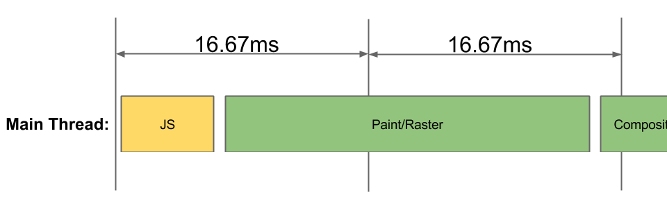
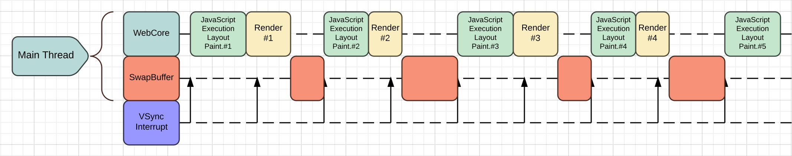
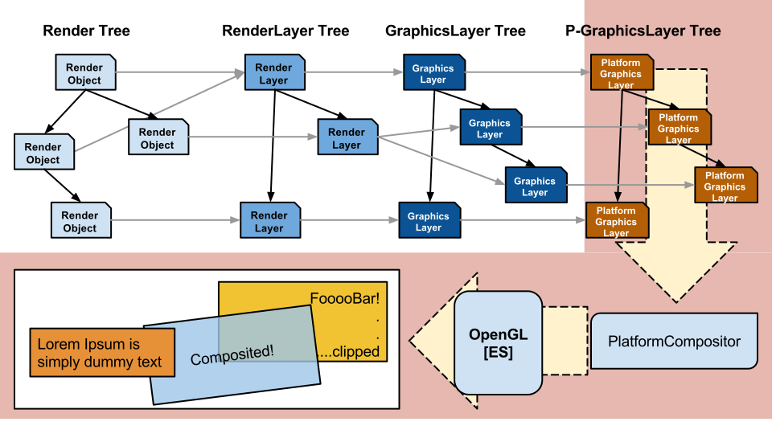
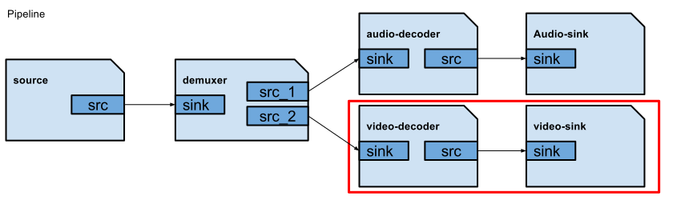
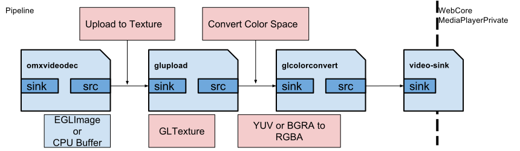
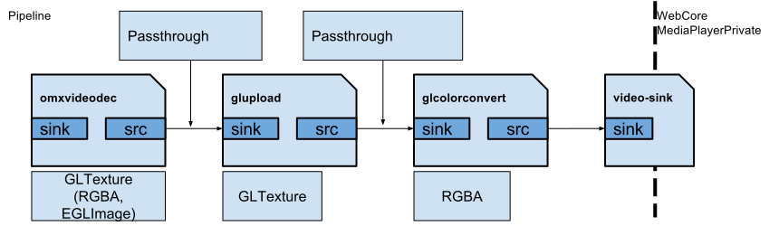
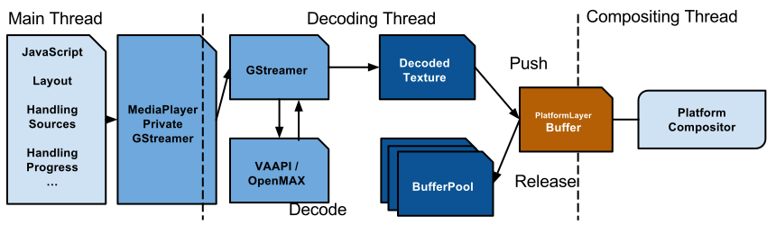
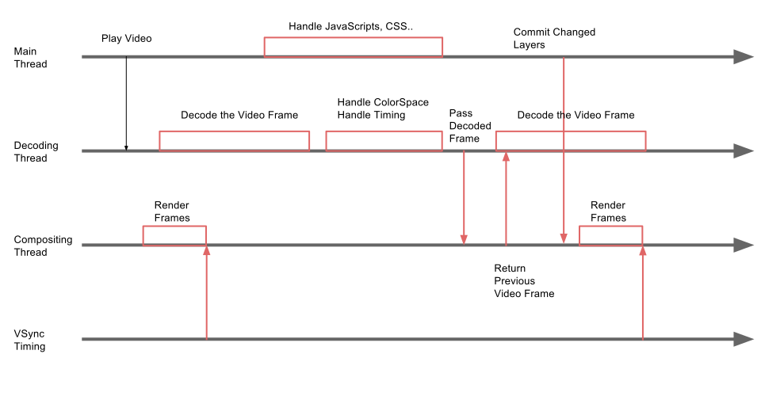
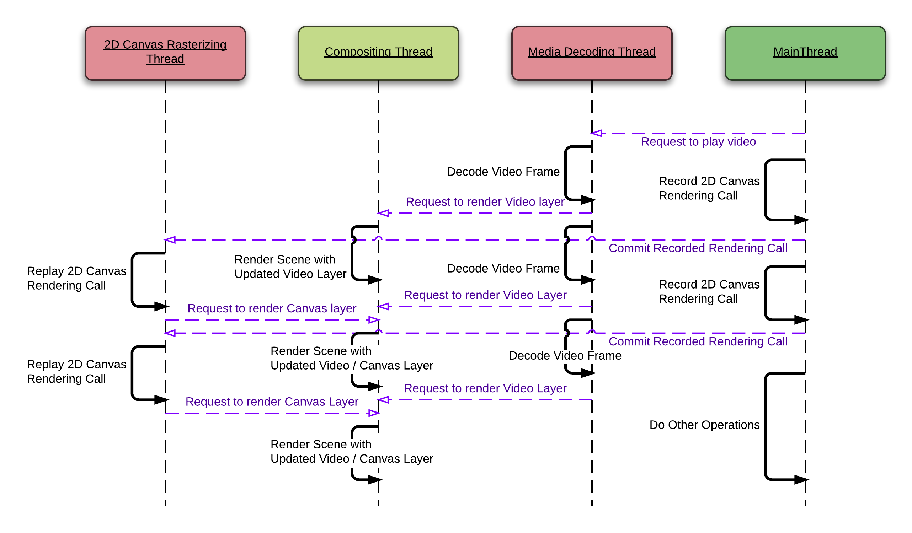

# Maximizing the performance of HTML5 Video in RPi2

Gwang Yoon Hwang

<small>yoon@igalia.com</small>


----

# What is the HTML5 Video?

<iframe data-src="./examples/video.html" width="100%" height="800px" clss="stretch"></iframe>

----

CSS
```
body {
  padding: 0;
  margin: 0;
  width: 100%;
  height: 100%;
  overflow: hidden;
}

#framerate {
...
```

JavaScript
```
  g.mvpMatrix.load(g.perspectiveMatrix);
  g.mvpMatrix.multiply(g.mvMatrix);
  g.mvpMatrix.setUniform(gl, g.u_modelViewProjMatrixLoc, false);

  gl.bindTexture(gl.TEXTURE_2D, tuxTexture);
  gl.drawElements(gl.TRIANGLES, g.box.numIndices, gl.UNSIGNED_BYTE, 0);
```

HTML
```
<video width="1280" height="720" autoplay loop>
<source src="big_buck_bunny_720p_h264.mov" type="video/mp4" />
</video>
<canvas id="example"></canvas>
<div id="framerate"></div>
```

----

# WebKit - a portable Web rendering engine

- PCs, phones, TVs, IVI, smartwatches, **Raspberry Pi**
- Mac, iOS, EFL, **GTK**

----

## WebKitGTK+

- Full-featured port of the WebKit rendering engine
- Useful in a wide rage of systems from desktop to embedded

<br>
## WebKit For Wayland

- Avoids using any toolkit
- Defaults to EGL, OpenGL ES for accelerated rendering of Web content
- Optimized for displaying the fullscreen web content
-- Youtube TV, Information displays, IVI, STBs..

----

# How WebKit Renders WebPage

----

## Steps for Rendering
- Parsing: Nodes to DOM Tree
- Constructing RenderObject Tree to RenderLayer Tree

----

### Parsing: Creates the DOM Tree from source


<small>From: https://developers.google.com/web/fundamentals/performance/critical-rendering-path/
<br>Under the Creative Commons Attribution 3.0 Licenses</small>

----

### Creating the Render Tree


<small>From: https://developers.google.com/web/fundamentals/performance/critical-rendering-path/
<br>Under the Creative Commons Attribution 3.0 Licenses</small>

----

<!-- .slide: data-state="no-title-footer" -->
### Creating the GraphicsLayer Tree and Compositing It


----

## Problems

- The main-thread is always busy (Parsing, Layout, JS ...)
- The main-thread can be blocked by VSync
- And we want awesome webpages which uses HTML5 Video

----

### VSync : Best Case


### VSync : Worse Case


----

### VSync : Worst Case


----

### Raspberry Pi2

* It is not a Rasberry Pi!
 * A 900MHz quad-core ARM Cortex-A7 CPU
* Why not utilize multi cores?

----

## Off-the-main-thread Compositing

<!-- .element: class="stretch" -->

----

## Compositing in the dedicated thread

- Free the main-thread from the Vsync and compositing operations
- It shows more smooth CSS animations, zoom, scrolling, and scale operations.

----

<!-- .slide: data-state="no-title-footer" -->


----

<!-- .slide: data-state="no-title-footer" -->


----

### Worst case

### Same case with dedicated compositing thread


----

### What we have done : WebKitGTK / WebKitForWayland

- Split compositing operations into the dedicated thread
- Utilize multi-core CPUs and GPU
- Play CSS Animation off-the-main-thread
- Reduce latencies of scrolling and scaling operations

----

## Video Rendering

----

### GStreamer
- Open source media framework for multimedia playback.
- GStreamer constructs graphs of media-handling components.
- Supports playback, streaming, complex audio mixing and non-linear video processing
- Can handle muxers/demuxers and codecs transparently.
- Add codecs/filters by writing plugins with a generic interface
- A major version is API and ABI stable.

----

### GStreamer OpenMax (gst-omx)

- Hardware decoders for H.264, VP8, Theora
- meta:EGLImage
- Custom audio sinks: HDMI and analog
- Very good integration within playbin

----

### GStreamer Pipeline


----

### GStreamer Pipeline - Inefficient


----

### Polish Gst-OMX and Gst-GL to remove overheads

- GstGLMemoryEGL (EGLImage + GLMemory)
- Remove additional texture allocations and copy operations
 - 3.5 Mb for each frame (720p, RGBA)
- **Passthrough**

----

### GStreamer Pipeline - Efficient


----

### Composite Decoded Frame


----

### Composite Decoded Frame

- Pass the decoded frame to the compositor directly
- Compositor composites the video without waiting main-thread

----



----

<!-- .slide: data-state="no-title-footer" -->


----

### Test results on the Raspberry Pi2

- Targeting 720p, 1080p
- 30 FPS on HTML5 Video playback
- 40-50 FPS with a 720p HTML5 Video and WebGL at same time
- Reduced memory consumption
- Still, needs to reduce ghost copies of decoded frame

----

## Thank you

### Questions?

